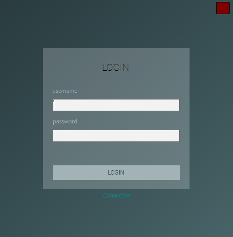
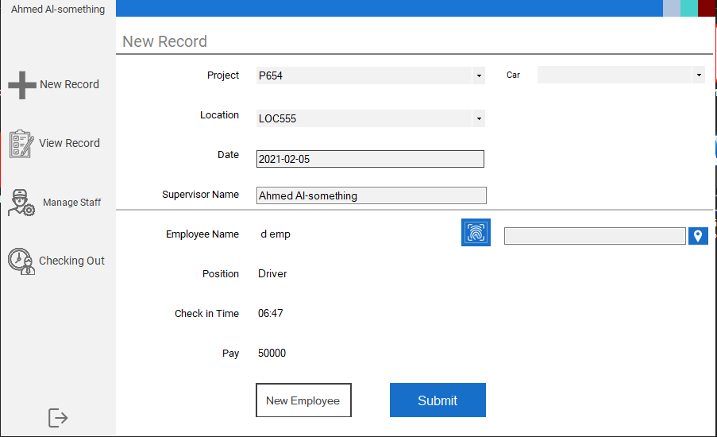
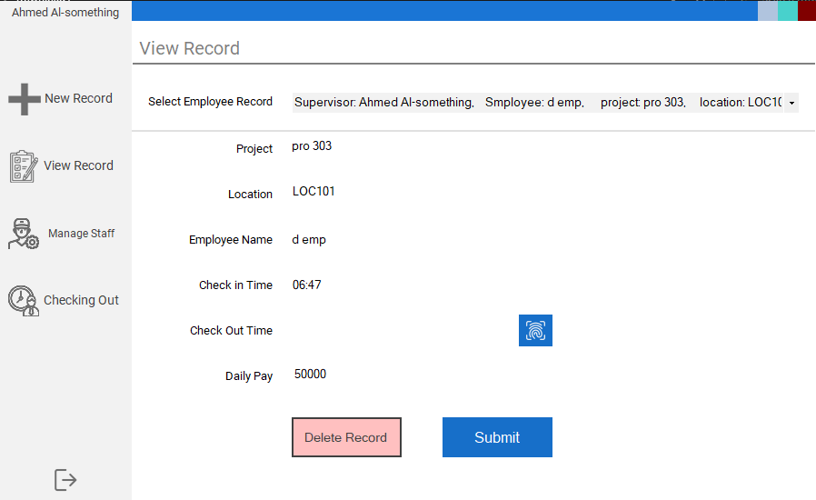
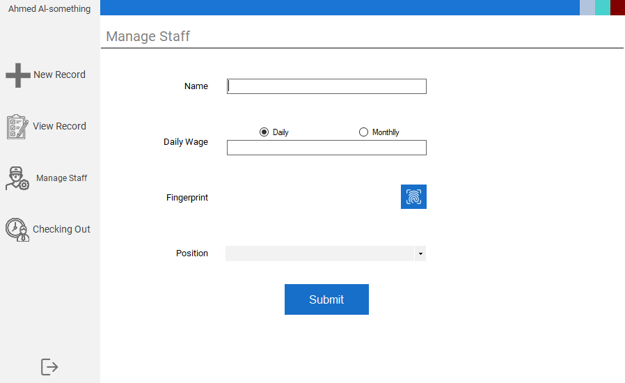
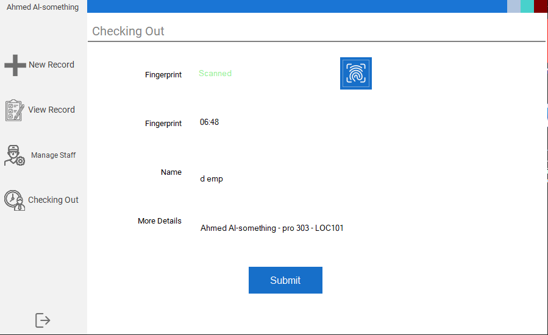
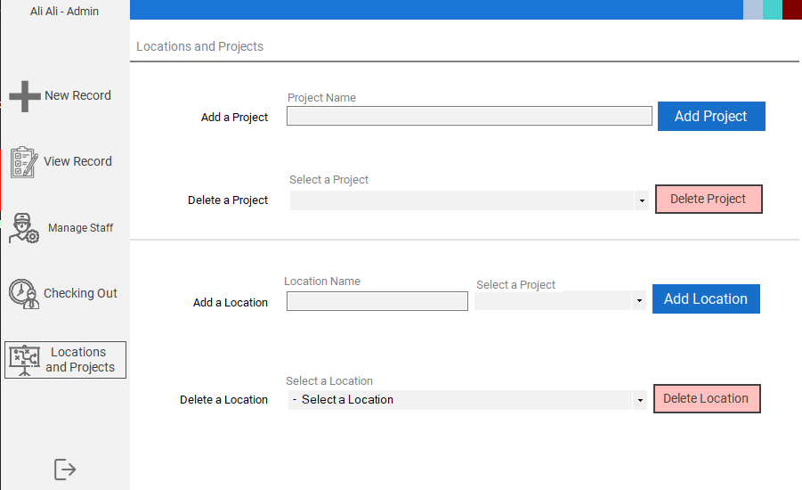

[![LinkedIn][linkedin-shield]][linkedin-url]

<!-- PROJECT LOGO -->

 

  

  <h3 align="center">Employee site Supervision System</h3>
  
## Built With C# 

 
 </img>
  
 </img>
  
 </img>
  
 </img>
   
 </img>
   
 </img>

[linkedin-shield]: https://img.shields.io/badge/-LinkedIn-black.svg?style=flat-square&logo=linkedin&colorB=555
[linkedin-url]: https://www.linkedin.com/in/it2121/

## Copyright and License

Copyright 2020 Mohammed Talib.

Licensed under the [MIT License](https://github.com/it2121/EAS/blob/master/LICENSE.txt)
